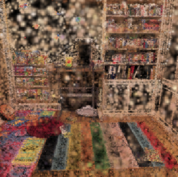
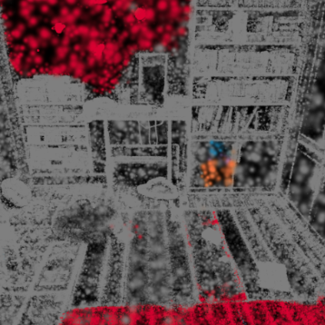

# Semantic Fusion for 3D Gaussian Splatting

This project extends **3D Gaussian Splatting (3DGS)** with **semantic awareness** by integrating 2D segmentation into the 3D representation.  
We use the **Segment Anything Model (SAM)** to generate masks from multiple novel views of a Gaussian-rendered scene. Labels are fused via **multi-view voting**, yielding a semantically annotated Gaussian point cloud.

📄 Full report: [`docs/SemanticFusionGS.pdf`](docs/SemanticFusionGS.pdf)

Colab: https://colab.research.google.com/drive/1BaptE13PzTk3jk3Mb9p78_r_4j-Q7WNY?usp=sharing

Website: https://tarungangadhar.github.io/semantic-fusion-website/

---

## Method Overview
- Render novel 2D views from the 3DGS scene.  
- Segment each view using **SAM**.  
- Project 2D masks into 3D, aggregate with voting.  
- Assign final semantic labels to splats.  
- Render semantically consistent scenes.

---

## Results
### Semantic Rendering Example
| Original 3DGS | Semantic-Fused 3DGS |
|---------------|----------------------|
|  |  |

The pipeline successfully separates large structures (walls, floor) and object-like regions (furniture, shelves).

---

## Applications
- Semantic-aware rendering  
- Object-centric editing (e.g., recoloring/removal)  
- Physics-based interactions (floor vs. water vs. objects)

---

## Limitations
- Small objects (toys, books) underrepresented due to occlusion.  
- SAM masks are region-level, not always object-centric.  
- Voting susceptible to viewpoint imbalance.

---

